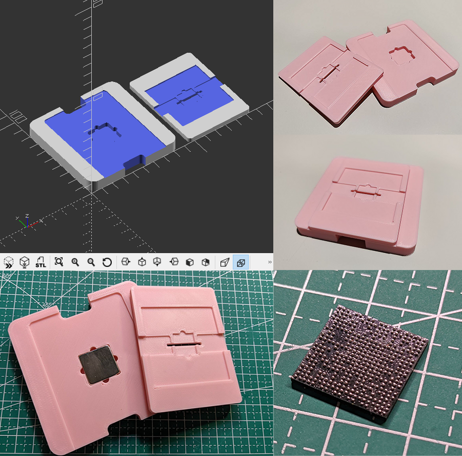

## Pit - BGAFixer
This is a low-cost magnetism chip fixer that can help to solder the BGA balls for chips.

**Please note**:  
This project contains no steel mesh, just the fixer itself.  
You should order your steel mesh separately.

## Attention
DO NOT heat your chip on the Pit directly, if your Pit is created from a plastic(PLA/PETG/ABS etc.) material.

You can take the steel mesh carefully, then move it to a heat sink.  
The chip won't drop down after you filled the solder paste on the steel mesh.

_Enjoy the Pit :)_

## License
Licensed under MIT with ❤.
